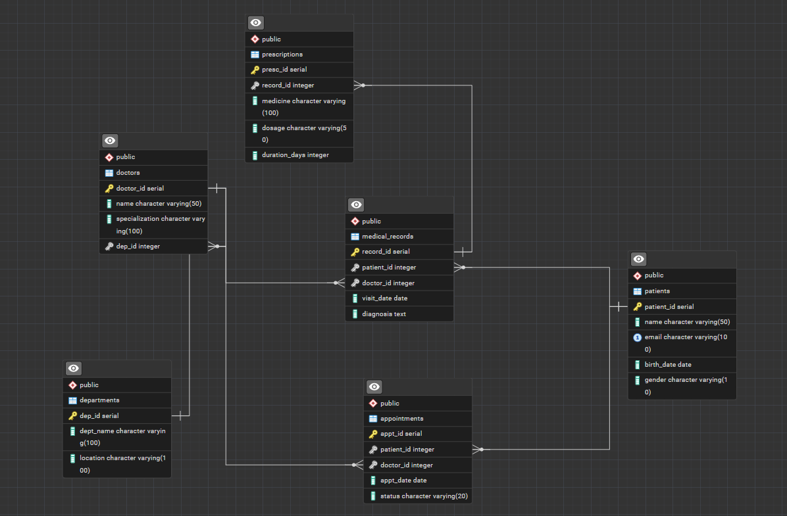

# Hospital Database System

A relational database system for managing hospital operations,
built with PostgreSQL.

## Database Schema



## Tables

- **departments** — Hospital departments and their locations
- **doctors** — Doctors with specializations linked to departments
- **patients** — Patient personal information
- **appointments** — Scheduled appointments between patients and doctors
- **medical_records** — Diagnoses written by doctors for patients
- **prescriptions** — Medicines prescribed per medical record

## Key Relationships

- Each doctor belongs to one department
- A patient can book multiple appointments with different doctors
- Each appointment can lead to a medical record
- A medical record can include multiple prescriptions

## Sample Queries

### All doctors with their departments
```sql
SELECT d.name, d.specialization, dept.dept_name
FROM doctors d
JOIN departments dept ON d.dept_id = dept.dept_id;
```

### Patient diagnoses and medicines
```sql
SELECT p.name AS patient, mr.diagnosis,
       pr.medicine, pr.dosage
FROM patients p
JOIN medical_records mr ON p.patient_id = mr.patient_id
JOIN prescriptions pr   ON mr.record_id  = pr.record_id
ORDER BY p.name;
```

## Tools Used

- PostgreSQL 16
- pgAdmin 4

## Author

Omar_Mowena
